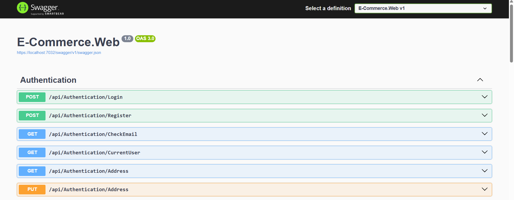
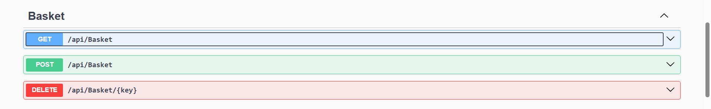
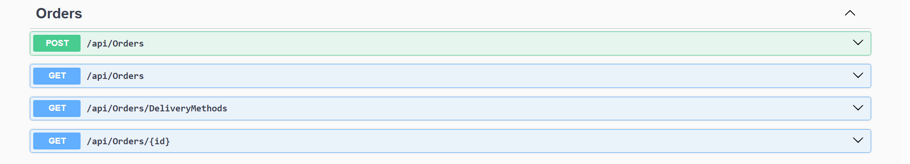
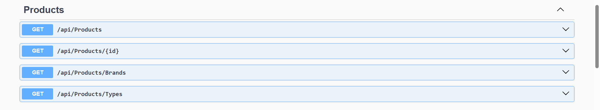

# Ecommerce API - .NET 8

A RESTful ecommerce API built with .NET 8 featuring JWT authentication, basket management, and order processing.

## Features

### 🔒 Authentication
- User registration and login
- JWT token generation and validation
- Email availability checking
- Current user endpoint

### 🧺 Basket System
- Create/update basket
- Retrieve user's basket
- Delete basket items
- 🔐 *All endpoints require valid JWT token*

### 📦 Order Management
*(All operations are for the current logged-in user)*

- **Create new orders**  
  `POST /api/orders` - Submit new order with products  
  *Validates: product exists, quantity > 0, valid address*

- **Retrieve order history**  
  `GET /api/orders` - Get all your orders  
  `GET /api/orders/{id}` - Get specific order by ID  

- **Get delivery methods**  
  `GET /api/orders/DeliveryMethods` - Available shipping options  

- 🔐 *All endpoints require valid JWT token*

### 🏷️ Products
- Product catalog with:
  - Name, description, price
  - Brand information
  - Product images
  - 🔐 *All endpoints require valid JWT token*

## Tech Stack
- **Framework**: ASP.NET Core 8
- **Database**: SQL Server with Entity Framework Core
- **Authentication**: JWT Bearer Tokens
- **Validation**: FluentValidation
- **API Documentation**: Swagger UI

## Getting Started

### Prerequisites
- .NET 8 SDK
- SQL Server

## 📸 UI Gallery

### 🔐 Authentication End Points
  

### 🧺 Basket End Points
  

### 📦 Orders End Points
  

### 🏷️ Products End Points
  

## Contact with me

  
  

